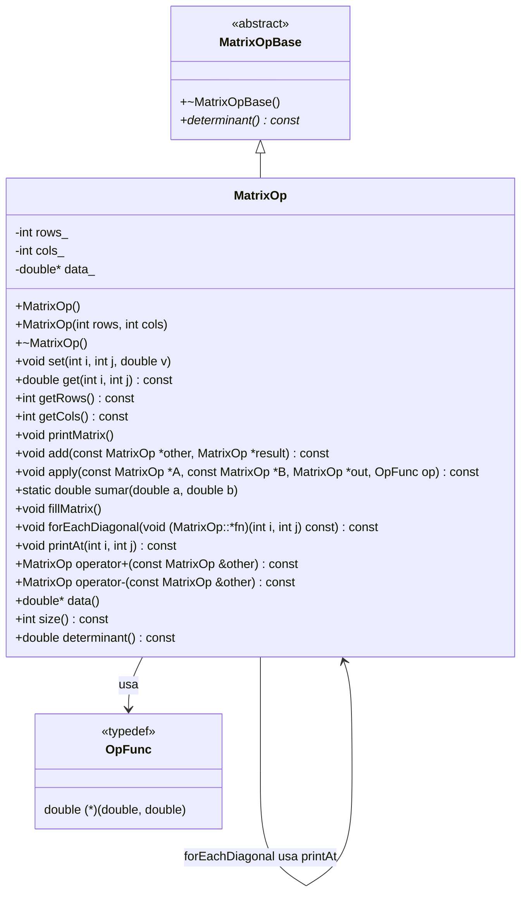

# El diagrama general es: 



# Clase Abstracta archivo .h
```cpp
#ifndef MATRIXOP_H
#define MATRIXOP_H
#include <iostream>
using namespace std;

#include <stdexcept>

template <typename T>
T maxValue(const T *arr, int n) {
    if (n <= 0) throw invalid_argument("Arreglo vacío");
    T max = arr[0];
    for (int i = 1; i < n; ++i) {
        if (arr[i] > max) {
            max = arr[i];
        }
    }
    return max;
}

/**
 * @brief Interfaz abstracta para operaciones avanzadas de matriz.
 */
class IMatrix {
   public:
    virtual ~IMatrix() = default;
    virtual double determinant() const = 0;
};

class MatrixOp : public IMatrix {
   public:
    double determinant() const override;

    MatrixOp();
    MatrixOp(int rows, int cols);
    ~MatrixOp();

    void set(int i, int j, double v);
    double get(int i, int j) const;

    int getRows() const;
    int getCols() const;

    void printMatrix();

    void add(const MatrixOp *other, MatrixOp *result) const;

    using OpFunc = double (*)(double, double);
    void apply(const MatrixOp *A, const MatrixOp *B, MatrixOp *out,
               OpFunc op) const;

    static double sumar(double a, double b);

    // Metodo para llenar los datos de la Matrix
    void fillMatrix();

    // Recorrido con puntero a miembro
    void forEachDiagonal(void (MatrixOp::*fn)(int i, int j) const) const;
    void printAt(int i, int j) const;

    // Sobrecarga de operadores
    //  Suma elemento a elemento: devuelve una nueva matriz
    MatrixOp operator+(const MatrixOp &other) const;

    // Resta elemento a elemento: devuelve una nueva matriz
    MatrixOp operator-(const MatrixOp &other) const;

    double *data();

    int size() const;

   private:
    int rows_, cols_;
    double *data_;
};

#endif  // MATRIXOP_H
```

# Archivo interfaz implementacion de metodos, constructores y destructor
```cpp
/**
 * @file MatrixOp.cpp
 * @brief Implementación de MatrixOp.
 * @date YYYY-MM-DD
 * @author Angel
 */

#include "MatrixOp.h"

#include <algorithm>
#include <iostream>
#include <stdexcept>
using namespace std;

// Constructor vacio
MatrixOp::MatrixOp() : rows_(0), cols_(0), data_(nullptr) {}

MatrixOp::MatrixOp(int rows, int cols)
    : rows_(rows), cols_(cols), data_(nullptr) {
    if (rows_ <= 0 || cols_ <= 0) {
        throw invalid_argument("Rows and Columns must be positive integers");
    }

    data_ = new double[rows_ * cols_];
    for (int i = 0; i < rows_ * cols_; ++i) {
        data_[i] = 0.0;
    }
}

MatrixOp::~MatrixOp() {
    delete[] data_;
    data_ = nullptr;
}

void MatrixOp::printMatrix() {
    for (int i = 0; i < rows_; ++i) {
        for (int j = 0; j < cols_; ++j) {
            cout << get(i, j) << " ";
        }
        cout << endl;
    }
}

void MatrixOp::set(int i, int j, double v) {
    if (i < 0 || i >= rows_ || j < 0 || j >= cols_) {
        throw out_of_range("Index out of range.");
    }
    data_[i * cols_ + j] = v;
}

double MatrixOp::get(int i, int j) const {
    if (i < 0 || i >= rows_ || j < 0 || j >= cols_) {
        throw out_of_range("Index out of bounds.");
    }
    return data_[i * cols_ + j];
}

int MatrixOp::getRows() const { return rows_; }
int MatrixOp::getCols() const { return cols_; }

// MAS FUNCIONALIDADES

void MatrixOp::add(const MatrixOp *other, MatrixOp *result) const {
    if (rows_ != other->rows_ || cols_ != other->cols_) {
        throw invalid_argument("Matrices must have the same dimensions");
    }

    int total = rows_ * cols_;
    for (int k = 0; k < total; ++k) {
        result->data_[k] = this->data_[k] + other->data_[k];
    }
}

double MatrixOp::sumar(double a, double b) { return a + b; }

void MatrixOp::apply(const MatrixOp *A, const MatrixOp *B, MatrixOp *out,
                     OpFunc op) const {
    if ((A->cols_ == B->cols_) && (A->rows_ == B->rows_)) {
        int result = A->cols_ * A->rows_;
        for (int k = 0; k < result; k++) {
            out->data_[k] = op(A->data_[k], B->data_[k]);
        }
    } else {
        throw invalid_argument("Both Matrix have not same dimensions");
    }
}

void MatrixOp::fillMatrix() {
    for (int i = 0; i < rows_; i++) {
        for (int j = 0; j < cols_; j++) {
            double newValue;
            cout << "Agrega un dato en la posicion [" << i << ", " << j
                 << "]: " << endl;
            cin >> newValue;
            set(i, j, newValue);
        }
    }
}

void MatrixOp::printAt(int i, int j) const { cout << get(i, j) << " "; }

void MatrixOp::forEachDiagonal(void (MatrixOp::*fn)(int i, int j) const) const {
    int ndim = min(rows_, cols_);
    for (int i = 0; i < ndim; i++) {
        (this->*fn)(i, i);
    }
    cout << endl;
}

MatrixOp MatrixOp::operator+(const MatrixOp &other) const {
    if (cols_ != other.cols_ || rows_ != other.rows_) {
        throw invalid_argument("Both Matrix have not same dimensions");
    } else {
        MatrixOp resultado(rows_, cols_);
        int dimensiones = cols_ * rows_;
        for (int k = 0; k < dimensiones; k++) {
            resultado.data_[k] = data_[k] + other.data_[k];
        }
        return resultado;
    }
}

MatrixOp MatrixOp::operator-(const MatrixOp &other) const {
    if (cols_ != other.cols_ || rows_ != other.rows_) {
        throw invalid_argument("Both Matrix have not same dimensions");
    } else {
        MatrixOp resultado(rows_, cols_);
        int dimensiones = cols_ * rows_;
        for (int k = 0; k < dimensiones; k++) {
            resultado.data_[k] = data_[k] - other.data_[k];
        }
        return resultado;
    }
}

double *MatrixOp::data() { return data_; }

int MatrixOp::size() const { return rows_ * cols_; }

double MatrixOp::determinant() const {
    if (rows_ != cols_) {
        throw logic_error("Matrix must be square");
    }

    if (rows_ == 2) {
        return get(0, 0) * get(1, 1) - get(0, 1) * get(1, 0);
    } else if (rows_ == 3) {
        // Regla de Sarrus:
        return get(0, 0) * get(1, 1) * get(2, 2) +
               get(0, 1) * get(1, 2) * get(2, 0) +
               get(0, 2) * get(1, 0) * get(2, 1) -
               get(0, 2) * get(1, 1) * get(2, 0) -
               get(0, 0) * get(1, 2) * get(2, 1) -
               get(0, 1) * get(1, 0) * get(2, 2);
    } else {
        throw logic_error("Implementar para 2×2 o 3×3");
    }
}
```